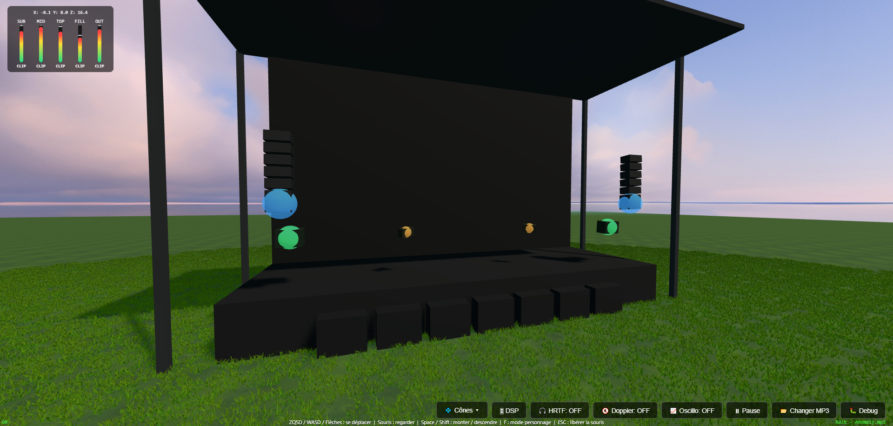
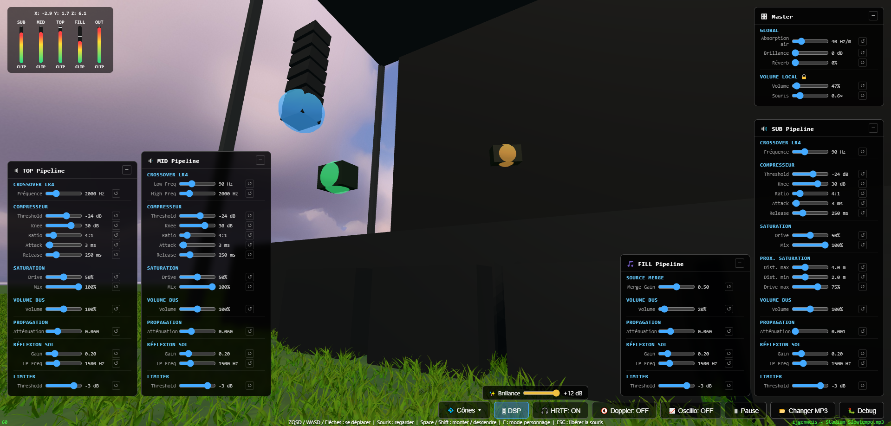

# 🎶 SoundStage3D - Simulateur de Sonorisation de Festival

[](https://opensource.org/licenses/MIT)

**SoundStage3D est une expérience de simulation audio 3D immersive qui s'exécute entièrement dans votre navigateur. Chargez votre musique et déplacez-vous dans un environnement de festival pour entendre et visualiser comment un système de sonorisation professionnel interagit avec l'espace.**

---

<h2 align="center">✨ <a href="https://Lotter-35.github.io/SoundStage3D/">🚀 ACCÉDER À LA DÉMONSTRATION LIVE 🚀</a> ✨</h2>

*(Note : L'expérience est optimisée pour les ordinateurs de bureau. Pour une immersion maximale, l'utilisation d'un casque audio de qualité avec une bonne restitution des basses est fortement recommandée.)*

---



## 🌟 Fonctionnalités

*   **Sonorisation 4-voies Pro :** Le son est séparé en **SUB**, **MID**, **TOP** et **FILL** via un crossover Linkwitz-Riley.
*   **Chaîne DSP par Bus :** Chaque bande de fréquence possède sa propre chaîne de traitement (Compresseur, Saturation, Limiteur).
*   **Simulation Acoustique :** Atténuation avec la distance, absorption de l'air, et réflexions au sol pour plus de réalisme.
*   **Spatialisation 3D :** Positionnement audio précis incluant un mode binaural (HRTF) et l'effet Doppler.
*   **Navigation FPS :** Exploration libre de la scène (modes "Vol" et "Personnage").
*   **Visualiseurs Audio :** Oscilloscope, vu-mètres par bus, et affichage des cônes de directivité.
*   **Contrôle Total en Temps Réel :** Ajustez des dizaines de paramètres audio via les panneaux DSP.
*   **Panneau de Débogage :** Overlay technique avec métriques de performance (FPS, mémoire, charge audio).



## 🚀 Comment Lancer le Projet Localement

Aucune compilation ou dépendance n'est nécessaire ! Le projet utilise des modules ES6 natifs.

1.  **Clonez le dépôt :**
    ```sh
    git clone https://github.com/USERNAME/SoundStage3D.git
    cd SoundStage3D
    ```
2.  **Lancez un serveur web local :**
    La méthode la plus simple est d'utiliser Python.
    ```sh
    # Python 3
    python -m http.server 8080
    ```
3.  **Ouvrez votre navigateur :**
    Rendez-vous sur [http://localhost:8080](http://localhost:8080).

## ⌨️ Contrôles

| Action                  | Touche / Commande               |
| ----------------------- | ------------------------------- |
| **Se déplacer**         | `ZQSD`, `WASD`, ou touches fléchées |
| **Regarder**              | `Souris`                        |
| **Monter / Sauter**     | `Barre d'espace`                |
| **Descendre**             | `Shift` (en mode vol)           |
| **Changer de mode**     | `F` (Vol libre ↔ Personnage)    |
| **Libérer la souris**    | `Échap`                         |

## 🛠️ Technologies Utilisées

*   [**Three.js**](https://threejs.org/) - Pour le moteur de rendu 3D.
*   **Web Audio API** - Pour tout le traitement audio avancé.
*   **JavaScript (ES6+ Modules)** - Code source moderne, sans bundler.
*   **HTML5 / CSS3**

## 🤝 Contribution

Les contributions, les corrections de bugs et les suggestions de fonctionnalités sont les bienvenues ! N'hésitez pas à ouvrir une *issue* ou une *pull request*.

1.  Forkez le projet.
2.  Créez votre branche de fonctionnalité (`git checkout -b feature/AmazingFeature`).
3.  Commitez vos changements (`git commit -m 'Add some AmazingFeature'`).
4.  Poussez vers la branche (`git push origin feature/AmazingFeature`).
5.  Ouvrez une Pull Request.

## 📄 Licence

Ce projet est distribué sous la licence MIT. Voir le fichier `LICENSE` pour plus d'informations.
