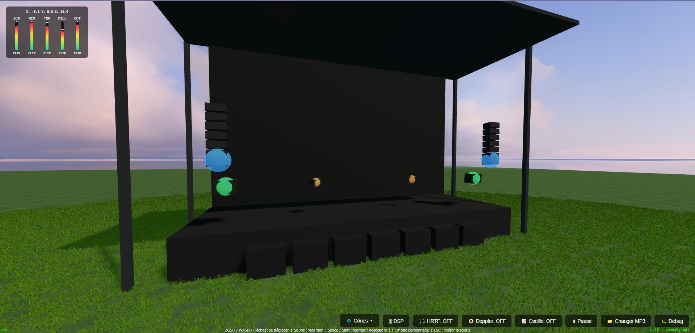
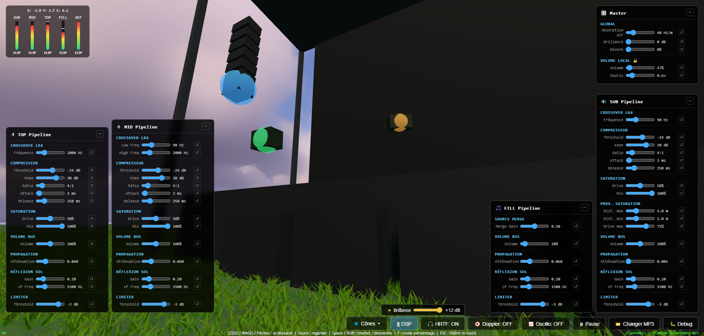

# 🎶 SoundStage3D - Simulateur de Sonorisation de Festival

[](https://opensource.org/licenses/MIT)

**SoundStage3D** est un simulateur acoustique 3D temps réel dans le navigateur. Glissez-déposez votre musique et explorez une scène de festival pour entendre comment le son se propage dans l'espace selon votre position.

---

<h2 align="center">✨ <a href="https://Lotter-35.github.io/SoundStage3D/">🚀 DÉMONSTRATION EN LIGNE 🚀</a> ✨</h2>

*(Utilisation d'un casque audio fortement recommandée)*

---



## ⚡ En Bref

* 🔊 **Système Son Pro :** Séparation 4 voies (Sub, Mid, Top, Front-Fill) sur 14 enceintes réparties sur scène.
* 🎧 **Acoustique Réaliste :** Spatialisation binaurale 3D, atténuation avec la distance, absorption de l'air et réverbération.
* 🎛️ **Régie DSP Complète :** Panneaux de contrôle pour ajuster filtres, compresseurs, saturations et limiteurs en direct.
* 📊 **Analyseur FFT :** Visualiseur de fréquences en temps réel branché sur votre sortie casque.
* 🚶 **Exploration Libre :** Déplacement fluide à la première personne (mode marche ou vol).



## ⌨️ Contrôles Rapides

| Action | Touche |
| --- | --- |
| **Se déplacer** | `Z Q S D` / `W A S D` |
| **Regarder** | `Souris` (cliquer pour verrouiller, `Échap` / `Tab` pour libérer) |
| **Sauter / Monter** | `Espace` |
| **Descendre** | `Shift` (en vol) |
| **Mode Vol ↔ Marche** | `F` |

## 🚀 Lancer en Local

Aucune installation complexe :

```sh
git clone https://github.com/Lotter-35/SoundStage3D.git
cd SoundStage3D
python -m http.server 8080
```
Puis ouvrez `http://localhost:8080` dans votre navigateur.

## 📄 Licence

Projet open-source sous licence [MIT](LICENSE).
